# ❄️ Social Winter of Code 2026 @ GroqTales

  
  

**Welcome, Winter Warriors!** Thank you for choosing **GroqTales** for your SWOC'26 journey. Let's turn code into stories!

---

## 🏔️ What is SWOC?

**Social Winter of Code (SWOC)** is an open-source program that helps students and professionals get started with real-world contributions during the winter. It’s all about learning, building, and community growth.

---

## 🛤️ Your Contribution Roadmap

We have created a clear process for beginners:

```mermaid
graph LR
    A[Pick an Issue] --> B[Comment to Assign]
    B --> C[Fork & Clone]
    C --> D[Code & Test]
    D --> E[Submit PR]
    E --> F{Review}
    F -- Fixes Needed --> D
    F -- Approved --> G[Merged! 🎉]
```

## 🛠️ How to Participate in GroqTales

### 1. Identify Your Domain
GroqTales is a multi-disciplinary project. You can choose to contribute to any of the following tracks based on your expertise:

| Track | Tech Stack |
| :--- | :--- |
| 🎨 **Frontend** | React.js / Next.js / Tailwind CSS |
| ⚙️ **Backend** | Python / FastAPI / Groq Cloud SDK |
| ⛓️ **Web3** | Blockchain, NFT Standards, and Smart Contracts |
| 📝 **Documentation** | Technical Writing, User Guides, and API Docs |

---

### 2. Follow the Workflow
To ensure a smooth contribution process during the Winter of Code, please follow these steps:

* 🔍 **Browse Issues:** Navigate to the "Issues" tab and filter by labels such as `SWOC'26`, `good-first-issue`, or `easy`.
* 📌 **Request Assignment:** Comment on the issue you wish to work on and wait for a Mentor to assign it to you. **Note: Pull Requests submitted without prior assignment will not be merged.**
* 💬 **Professional Commits:** Use descriptive and conventional commit messages.
    * *Example:* `feat: integrated AI-driven story generation engine #12`

---

## 📊 Level & Points System

Points are awarded based on the complexity and impact of your Pull Request:

| Label | Level | Complexity | Points Reward |
| :--- | :--- | :--- | :--- |
| `level-1` | 🟢 Easy | Documentation, Typos, or Minor Bug Fixes | **10 Points** |
| `level-2` | 🟡 Medium | Feature Enhancements or UI Refinement | **25 Points** |
| `level-3` | 🔴 Hard | Core Logic, Web3 Integration, or AI Optimization | **50 Points** |

---

## 💬 Connect with the Squad

* **Discord:** [Join the GroqTales SWOC Channel](https://discord.gg/JK29FZRm) for real-time discussions, project brainstorming, and community support.
* **Mentors:** If you are stuck on a technical blocker for more than 24 hours, feel free to tag the project mentors in your Issue or Pull Request thread.

---

## 📜 Hall of Fame
Every accepted contribution earns you a spot in our official **[CONTRIBUTORS.md](./CONTRIBUTORS.md)** file and recognition on our project website! ✨

### ❄️ Let's make this winter legendary! ❄️

[**Main Repository**](https://github.com/IndieHub25/GroqTales) | [**SWOC Official Website**](https://socialwinterofcode.com/)

